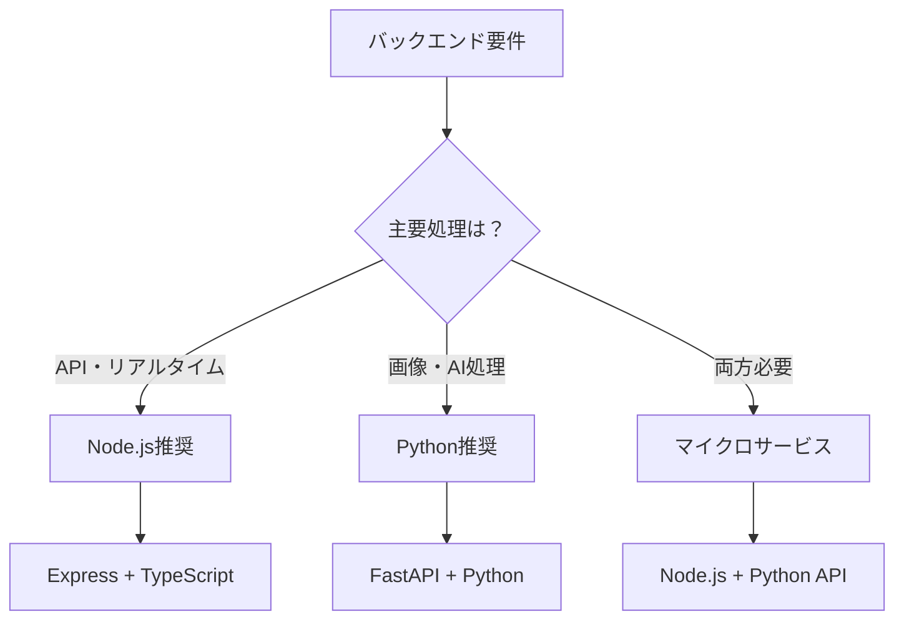
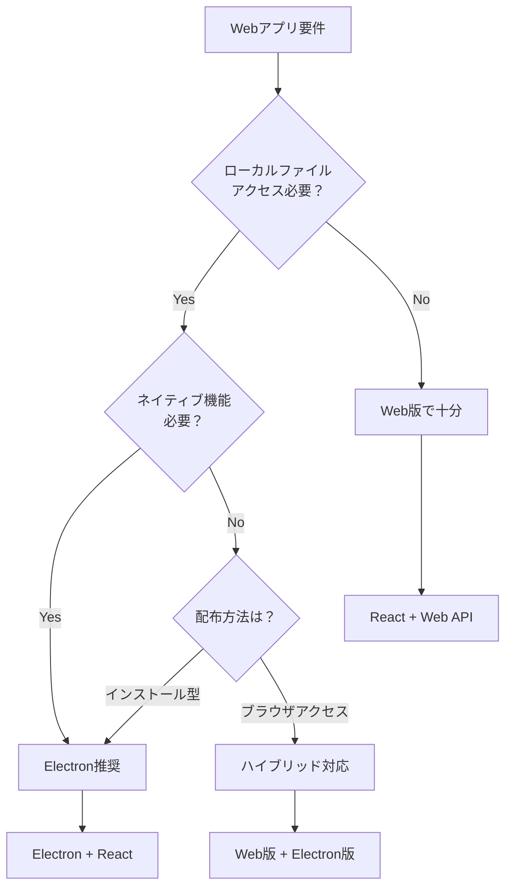
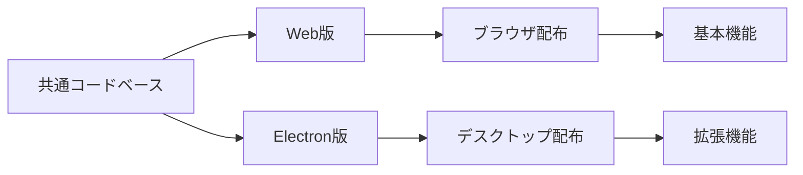

# Webアプリケーション開発技術選択ガイド

## 📋 概要

このガイドは、paint-color-assistant2プロジェクトの開発過程で得られた実践的な知見をまとめたものです。
Streamlit → React/Node.js → Electron化という技術移行の経験から、適切な技術選択のための指針を提供します。

---

## 🎯 技術選択の判断基準

### 1. クライアント側処理の必要性評価

#### 🔍 判断ポイント
```
✅ クライアント側処理が必要な場合：
- リアルタイムなUI操作（色調整、画像操作など）
- 頻繁なユーザーインタラクション
- レスポンス性能が重要な機能
- ネットワーク負荷軽減が必要

❌ サーバー側処理で十分な場合：
- 重い計算処理
- データベース操作
- ファイル永続化
- セキュリティが重要な処理
```

#### 📊 実例：色調コントローラー
```python
# ❌ Streamlit版（問題あり）
# 色調整の度にAPI Call → 性能問題
def adjust_color(rgb_values):
    response = requests.post('/api/adjust', json=rgb_values)
    return response.json()

# ✅ React版（解決）
// クライアント側で即座に処理
const adjustColor = (rgbValues) => {
  const adjusted = applyColorAdjustment(rgbValues);
  setDisplayColor(adjusted);
  // 必要時のみサーバーに送信
};
```

---

## 🏗️ フロントエンド技術選択

### React vs Vue vs その他

#### ⚛️ React
```
✅ メリット：
- 豊富なエコシステム
- TypeScript統合が優秀
- 企業採用率が高い
- Canvas操作ライブラリが充実
- Electron統合が容易

❌ デメリット：
- 学習コストが高い
- 設定が複雑
- 頻繁なアップデート
```

#### 🟢 Vue.js
```
✅ メリット：
- 学習コストが低い
- テンプレート記法が直感的
- 軽量で高速
- 日本語ドキュメントが充実

❌ デメリット：
- エコシステムがReactより小さい
- 企業採用率がやや低い
- TypeScript統合がReactより劣る
```

#### 🔵 Angular
```
✅ メリット：
- 大規模アプリケーション向け
- TypeScript標準
- 包括的なフレームワーク

❌ デメリット：
- 学習コストが非常に高い
- 小規模プロジェクトには過剰
- バンドルサイズが大きい
```

### 🎯 推奨選択基準

| プロジェクト規模 | チーム経験 | 推奨技術 | 理由 |
|------------------|------------|----------|------|
| 小〜中規模 | JavaScript初心者 | Vue.js | 学習コストが低い |
| 中〜大規模 | JavaScript経験者 | React | エコシステムが豊富 |
| 大規模企業 | TypeScript重視 | Angular | 型安全性と構造化 |

---

## 🖥️ バックエンド技術選択

### Node.js vs Python

#### 🟨 Node.js
```
✅ メリット：
- フロントエンドと言語統一
- 非同期処理が得意
- リアルタイム通信（WebSocket）
- JSON処理が高速
- npm エコシステム

❌ デメリット：
- CPU集約的処理が苦手
- シングルスレッド制限
- 科学計算ライブラリが少ない
```

#### 🐍 Python
```
✅ メリット：
- 科学計算・AI/MLライブラリが豊富
- 画像処理（PIL, OpenCV）
- 数値計算（NumPy, SciPy）
- 学習コストが低い
- データ分析に最適

❌ デメリット：
- 実行速度が遅い
- GIL（Global Interpreter Lock）
- リアルタイム処理が苦手
```

### 🎯 選択指針



#### 📋 実用的判断基準
```
Node.js を選ぶべき場合：
✅ フロントエンドがJavaScript系
✅ リアルタイム通信が必要
✅ 軽量なAPI開発
✅ 開発チームがJavaScript得意

Python を選ぶべき場合：
✅ 画像・動画処理が中心
✅ AI/ML機能が必要
✅ 科学計算が重要
✅ データ分析機能が必要
```

---

## 🖥️ Electron化の判断基準

### Electron化のメリット・デメリット

#### ✅ メリット
```
🔓 制約突破：
- ローカルファイル直接アクセス
- PATH指定でのファイル読み込み
- ネイティブファイルダイアログ
- システムAPI利用

🎨 UX向上：
- デスクトップアプリの操作感
- メニューバー・ショートカット
- ウィンドウ管理
- オフライン動作

📦 配布利便性：
- インストーラー作成
- 自動更新機能
- クロスプラットフォーム対応
```

#### ❌ デメリット
```
⚡ パフォーマンス：
- メモリ使用量が大きい
- 起動時間が長い
- バッテリー消費が多い

🔧 開発複雑性：
- ビルド設定が複雑
- デバッグが困難
- セキュリティ考慮事項

📦 配布サイズ：
- アプリサイズが大きい（100MB+）
- 更新ファイルサイズ
```

### 🎯 Electron化判断フローチャート



### 📋 Electron化が必要な機能例

| 機能 | Web版 | Electron版 | 必要性 |
|------|-------|------------|--------|
| ファイル選択 | ✅ | ✅ | 低 |
| PATH直接入力 | ❌ | ✅ | 中 |
| フォルダ監視 | ❌ | ✅ | 高 |
| システム通知 | 制限あり | ✅ | 中 |
| 自動起動 | ❌ | ✅ | 高 |
| メニューバー | ❌ | ✅ | 中 |

---

## 🔧 Electron化実装ガイド

### 実装手順と注意点

#### 1. 環境構築
```bash
# 1. Electronインストール
npm install --save-dev electron

# 2. 開発用スクリプト追加
# package.json
{
  "main": "electron-example/main.js",
  "scripts": {
    "electron": "electron .",
    "electron:dev": "NODE_ENV=development electron ."
  }
}
```

#### 2. メインプロセス実装
```javascript
// main.js - 重要なポイント
const { app, BrowserWindow, ipcMain } = require('electron');

function createWindow() {
  const mainWindow = new BrowserWindow({
    webPreferences: {
      nodeIntegration: false,        // ✅ セキュリティ重要
      contextIsolation: true,        // ✅ セキュリティ重要
      preload: path.join(__dirname, 'preload.js')
    }
  });

  // 🔧 開発環境判定
  const isDev = process.env.NODE_ENV === 'development';
  if (isDev) {
    mainWindow.loadURL('http://localhost:5173');
    mainWindow.webContents.openDevTools();
  } else {
    mainWindow.loadFile('dist/index.html');
  }
}
```

#### 3. プリロードスクリプト
```javascript
// preload.js - セキュアなAPI公開
const { contextBridge, ipcRenderer } = require('electron');

contextBridge.exposeInMainWorld('electronAPI', {
  // ✅ 安全なAPI公開
  loadImageFromPath: (path) => ipcRenderer.invoke('load-image-from-path', path),
  showOpenDialog: () => ipcRenderer.invoke('show-open-dialog')
});
```

#### 4. レンダラープロセス（React側）
```typescript
// electronUtils.ts - 環境判定
export const isElectron = (): boolean => {
  return typeof window !== 'undefined' && window.electronAPI !== undefined;
};

export const loadImageFromPath = async (path: string) => {
  if (isElectron()) {
    return await window.electronAPI.loadImageFromPath(path);
  } else {
    console.warn('PATH読み込みはElectron環境でのみ利用可能');
    return { success: false, error: 'ブラウザ環境では利用できません' };
  }
};
```

### 🚨 よくある失敗と対策

#### 失敗例1: セキュリティ設定
```javascript
// ❌ 危険な設定
webPreferences: {
  nodeIntegration: true,     // セキュリティリスク
  contextIsolation: false    // セキュリティリスク
}

// ✅ 安全な設定
webPreferences: {
  nodeIntegration: false,
  contextIsolation: true,
  preload: path.join(__dirname, 'preload.js')
}
```

#### 失敗例2: 開発サーバー接続
```javascript
// ❌ 固定ポート指定
mainWindow.loadURL('http://localhost:5173');

// ✅ ポート試行とフォールバック
const tryPorts = [5173, 5174, 5175];
for (const port of tryPorts) {
  try {
    await mainWindow.loadURL(`http://localhost:${port}`);
    break;
  } catch (error) {
    console.log(`ポート ${port} 接続失敗`);
  }
}
```

#### 失敗例3: 環境変数認識
```bash
# ❌ 環境変数未設定
npx electron main.js

# ✅ 開発環境指定
NODE_ENV=development npx electron main.js
```

---

## 🎯 推奨技術スタック

### 標準構成（中規模プロジェクト）

```yaml
フロントエンド:
  フレームワーク: React 18 + TypeScript
  ビルドツール: Vite
  状態管理: React Hooks (小規模) / Zustand (中規模)
  スタイル: CSS Modules / Styled Components

バックエンド:
  ランタイム: Node.js + TypeScript
  フレームワーク: Express
  実行環境: tsx (開発) / tsc (本番)

デスクトップ:
  フレームワーク: Electron (必要時)
  セキュリティ: contextBridge + preload

開発ツール:
  テスト: Vitest + Selenium
  リンター: ESLint + Prettier
  型チェック: TypeScript strict mode
```

### 🔄 ハイブリッド対応パターン



---

## 📊 技術選択チェックリスト

### プロジェクト開始時の確認事項

#### ✅ 要件分析
```
□ クライアント側処理の必要性
□ ローカルファイルアクセスの必要性
□ リアルタイム性の要求レベル
□ 配布方法（Web/デスクトップ）
□ チームのスキルセット
□ 開発期間・予算
```

#### ✅ 技術選択
```
□ フロントエンド技術の決定
□ バックエンド技術の決定
□ Electron化の必要性判断
□ テスト戦略の策定
□ 開発環境の構築
```

#### ✅ アーキテクチャ設計
```
□ コンポーネント設計
□ API設計
□ 状態管理方針
□ セキュリティ考慮事項
□ パフォーマンス要件
```

---

## 🎉 まとめ

### 重要な教訓

1. **クライアント処理の重要性**: UIの応答性にはクライアント側処理が不可欠
2. **技術統一の価値**: フロント・バック同一言語による開発効率向上
3. **ハイブリッド対応の有効性**: Web版とElectron版の併用で最適解を実現
4. **段階的移行の重要性**: Streamlit → React → Electron の段階的アプローチ

### 🚀 今後の発展

- **PWA対応**: Web版のネイティブアプリ化
- **WebAssembly**: 重い処理のクライアント側実行
- **Tauri**: Electronの軽量代替案
- **マイクロフロントエンド**: 大規模アプリケーションの分割

---

**このガイドが、適切な技術選択と効率的な開発の一助となることを願います。** 🎯

---

*最終更新: 2025年12月25日*
*プロジェクト: paint-color-assistant2*