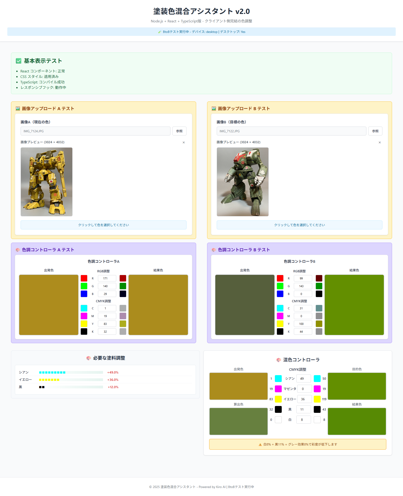

# 塗装色混合アシスタント v2.0 - 統合要件書

## プロジェクト概要

### 目的
塗装作業における色調整を支援するWebアプリケーション。画像から色を抽出し、目標色に近づけるための塗料混合比率を科学的に計算する。Webブラウザでの利用(PC,スマホ)を中心とし、Electronによるデスクトップ版も提供する。

### 設計哲学
- **Web-First**: ブラウザでの利用を主軸とした設計
- **Electron Optional**: デスクトップ機能は追加オプション
- **クライアント完結**: サーバー依存を最小化した処理

### 技術スタック
- **フロントエンド**: React 18 + TypeScript + Vite
- **バックエンド**: Node.js + Express + TypeScript（最小構成）
- **デスクトップ**: Electron（オプション）
- **色処理**: 独自実装（RGB⇔CMYK変換）
- **画像処理**: Canvas API
- **デプロイ**: GitHub Pages（Web版）+ Electron Builder（デスクトップ版）

### 画面サンプル
現在の実装状況は以下の画像を参照。レスポンシブデザインによる2カラム（デスクトップ）/縦積み（モバイル）レイアウトを実現。

#[[file:../画面サンプル.png]]

**画面構成の詳細**:
- **左カラム**: 画像アップロード・プレビュー、色調整コントローラー（RGB/CMYK）
- **右カラム**: 色比較表示、塗料混合結果表示、混色コントローラー
- **レスポンシブ対応**: モバイルでは縦積みレイアウトに自動切り替え
- **UI要素**: コンパクトな塗料調整バー、色インジケーター、リアルタイム計算結果

#### 画面レイアウト（アスキーアート）
```
┌─────────────────────────────────────────────────────────────────────────────────────┐
│                        🎨 塗装色混合アシスタント v2.0                                │
├─────────────────────────────────────────────────────────────────────────────────────┤
│  ┌─────────────────────────────┐    ┌─────────────────────────────────────────────┐  │
│  │          画像A              │    │            画像B                           │  │
│  │  ┌─────────────────────────┐  │    │  ┌─────────────────────────────────────┐  │  │
│  │  │                        │  │    │  │                                    │  │  │
│  │  │     画像プレビューA       │  │    │  │        画像プレビューB              │  │  │
│  │  │                        │  │    │  │                                    │  │  │
│  │  │                        │  │    │  │                                    │  │  │
│  │  └─────────────────────────┘  │    │  └─────────────────────────────────────┘  │  │
│  │  [ファイル選択A] [ドロップ]     │    │  [ファイル選択B] [ドロップ]              │  │
│  └─────────────────────────────┘    └─────────────────────────────────────────────┘  │
│  ┌─────────────────────────────┐    ┌─────────────────────────────────────────────┐  │
│  │      色調コントローラーA       │    │         色調コントローラーB                │  │
│  │  RGB: R[255] G[128] B[64]   │    │  RGB: R[200] G[150] B[100]               │  │
│  │  ■■■■■■■■■■ ■■■■■□□□□□ ■■□□□□□□□□ │    │  ■■■■■■■■□□ ■■■■■■□□□□ ■■■□□□□□□□ │  │
│  │  CMYK: C[25] M[50] Y[75] K[10] │    │  CMYK: C[30] M[40] Y[60] K[15]        │  │
│  │  ■■■□□□□□□□ ■■■■■□□□□□ ■■■■■■■□□□ ■□□□□□□□□□ │    │  ■■■□□□□□□□ ■■■■□□□□□□ ■■■■■■□□□□ ■■□□□□□□□□ │  │
│  └─────────────────────────────┘    └─────────────────────────────────────────────┘  │
├─────────────────────────────────────────────────────────────────────────────────────┤
│  ┌─────────────────────────────┐    ┌─────────────────────────────────────────────┐  │
│  │       必要な塗料調整         │    │         混色コントローラー                  │  │
│  │  シアン    ■■■■□□□□ +15%  │    │  ┌─────────┐  調整  ┌─────────┐            │  │
│  │  マゼンタ  ■■■□□□□□ +8%   │    │  │ 算出色  │   ↕   │ 結果色  │            │  │
│  │  イエロー  ■■■■■■□□ +22%  │    │  │ ■■■■■ │ C[+5] │ ■■■■■ │            │  │
│  │  黒       ■■□□□□□□ +5%   │    │  │ 予想値  │ M[+3] │ 実際値  │            │  │
│  │  白       ■□□□□□□□ +2%   │    │  └─────────┘ Y[+8] └─────────┘            │  │
│  └─────────────────────────────┘    │                K[+2]                      │  │
│                                   └─────────────────────────────────────────────┘  │
└─────────────────────────────────────────────────────────────────────────────────────┘
```

 

## 機能要件

### 1. 画像処理機能

#### 1.1 画像読み込み
- **PATH入力**: ローカルファイルパスの直接入力（Electron環境のみ）
- **ファイル選択**: ネイティブファイル選択ダイアログ
- **ドラッグ&ドロップ**: ファイルのドラッグ&ドロップ対応
- **対応フォーマット**: JPEG, PNG, BMP, TIFF, WebP, HEIC, HEIF

#### 1.2 画像プレビュー
- **Canvas表示**: 高品質な画像プレビュー
- **クリック色選択**: 画像上のクリックによる色抽出
- **座標変換**: 正確な色取得のための座標変換
- **エラーハンドリング**: 画像読み込み失敗時の適切な処理

### 2. 色調整機能

#### 2.1 色空間変換
- **RGB⇔CMYK変換**: 高精度な色空間変換
- **リアルタイム同期**: RGB/CMYK値の相互同期
- **変換ループ防止**: 無限ループを防ぐ安全機構

#### 2.2 色調コントローラー
- **RGB調整**: 赤・緑・青成分の個別調整（0-255）
- **CMYK調整**: シアン・マゼンタ・イエロー・黒成分の調整（0-100%）
- **出発色保持**: 調整前の基準色を保持
- **結果色表示**: 調整後の色をリアルタイム表示

**色調コントローラーレイアウト**:
```
┌─────────────────────────────────────────────────────────────────────────────┐
│  ┌─────────────┐        ┌─────────────────┐        ┌─────────────┐          │
│  │   調整前    │        │   RGB/CMYK調整   │        │   調整後    │          │
│  │ ┌─────────┐ │        │ R [255] ■■■■■■■■■■ │        │ ┌─────────┐ │          │
│  │ │ 色見本  │ │        │ G [128] ■■■■■□□□□□ │        │ │ 色見本  │ │          │
│  │ └─────────┘ │        │ B [64]  ■■□□□□□□□□ │        │ └─────────┘ │          │
│  │ RGB値表示   │        │ ─────────────────── │        │ RGB値表示   │          │
│  │ CMYK値表示  │        │ C [25%] ■■■□□□□□□□ │        │ CMYK値表示  │          │
│  └─────────────┘        │ M [50%] ■■■■■□□□□□ │        └─────────────┘          │
│                         │ Y [75%] ■■■■■■■□□□ │                               │
│                         │ K [10%] ■□□□□□□□□□ │                               │
│                         └─────────────────┘                               │
└─────────────────────────────────────────────────────────────────────────────┘
```

**レスポンシブ特性**:
- **デスクトップ**: 左右の色エリアが十分な幅で表示
- **タブレット**: 中央の調整エリア固定、左右エリアが適度に縮小
- **モバイル**: 左右エリア最小幅、調整エリアが画面幅の大部分を占有
- **リアルタイム連動**: 調整値変更時に調整後の色が即座に更新

### 3. 塗料混合計算機能

#### 3.1 混合比率計算
- **CMYK差分計算**: 出発色と目標色のCMYK差分算出
- **補色理論適用**: 色を減らす場合の補色追加計算
- **白・黒調整**: 明度調整のための白・黒塗料計算
- **統合処理**: 同一塗料の指示を統合

#### 3.2 混色コントローラー
- **塗料指示**: 追加すべき塗料と量の表示
- **視覚的表示**: 各塗料の色と量をバー表示
- **逆算結果**: 計算結果を適用した予想色の表示

**混色コントローラーレイアウト**:
```
┌─────────────────────────────────────────────────────────────────────────────┐
│  ┌─────────────┐        ┌─────────────────┐        ┌─────────────┐          │
│  │   出発色    │        │   CMYK調整      │        │   目的色    │          │
│  │ ┌─────────┐ │   9 ■ │ C [+0] % ■■■■■■■■■■ │ ■  9   │ ┌─────────┐ │          │
│  │ │ 色見本  │ │  30 ■ │ M [+10] % ■■■■■■■■■■ │ ■ 40   │ │ 色見本  │ │          │
│  │ └─────────┘ │  34 ■ │ Y [+0] % ■■■■■■■■■■ │ ■ 34   │ └─────────┘ │          │
│  │  9,30,34,52 │  52 ■ │ K [+20] % ■■■■■■■■■■ │ ■ 72   │  9,40,34,72 │          │
│  └─────────────┘      ■ │ W [+5] % ■■■■■■■■■■ │ ■  5   └─────────────┘          │
│  ┌─────────────┐        └─────────────────┘        ┌─────────────┐          │
│  │   算出色    │                                   │   結果色    │          │
│  │ ┌─────────┐ │                                   │ ┌─────────┐ │          │
│  │ │ 色見本  │ │                                   │ │ 色見本  │ │          │
│  │ └─────────┘ │                                   │ └─────────┘ │          │
│  │  計算結果   │                                   │  実際結果   │          │
│  └─────────────┘                                   └─────────────┘          │
└─────────────────────────────────────────────────────────────────────────────┘
```

**4箇所の色の意味と連動**:
- **出発色（左上）**: 画像から抽出した基準色（固定値）
- **目的色（右上）**: 画像から抽出した目標色（固定値）
- **算出色（左下）**: 出発色に必要な塗料調整を適用した理論値（自動計算）
- **結果色（右下）**: CMYK調整値を手動入力した実際の混色結果（手動調整連動）

**操作連動**:
- **自動計算**: 出発色→目的色の差分から算出色を自動生成
- **手動調整**: CMYK調整値の変更により結果色がリアルタイム更新
- **目標一致**: 結果色が算出色と一致するよう調整値を微調整可能

**レスポンシブ特性**:
- **デスクトップ**: 4つの色エリアが十分な幅で表示
- **タブレット**: 中央の調整エリア固定、4つの色エリアが適度に縮小
- **モバイル**: 色エリア最小幅、調整エリアが画面幅の大部分を占有
- **リアルタイム連動**: 調整値変更時に結果色が即座に更新

### 4. ユーザーインターフェース

#### 4.1 レスポンシブデザイン
- **デスクトップ**: 2カラムレイアウト（左右分割）
- **モバイル**: 縦積みレイアウト
- **デバイス検出**: 自動的なレイアウト切り替え

#### 4.2 コンポーネント構成
- **ImageUpload**: 画像アップロード・プレビュー
- **ColorController**: RGB/CMYK色調整
- **ColorMixingDisplay**: 色比較表示
- **PaintMixingController**: 塗料混合結果表示
- **CompactMixingBar**: コンパクトな塗料調整バー表示

#### 4.3 UI改善機能
- **コンパクト表示**: 塗料調整の視覚的バー表示
- **色インジケーター**: 各塗料の色を視覚的に表示
- **調整前後の値表示**: CMYK値の変化を明確に表示

### 7. モバイルUX改善機能

#### 7.1 混色コントローラ操作性改善
- **◀▶ボタン追加**: シアン・マゼンタ・イエロー・黒・白の各成分に◀▶ボタンを追加
- **レスポンシブ表示**: PC表示では非表示、モバイル表示でのみ表示
- **タッチ操作**: ◀ボタンで1%減少、▶ボタンで1%増加
- **長押し機能**: ボタン長押しによる連続増減操作
- **UI一貫性**: 既存の色調コントローラと同じデザイン・操作感

#### 7.2 操作性向上
- **直感的操作**: 専門知識不要のタッチ操作
- **数値範囲制約**: 0-100%の適切な範囲制限
- **視覚的フィードバック**: ボタン押下時の明確な反応
- **文字選択防止**: ボタン操作中のテキスト選択抑制

**混色コントローラ◀▶ボタンレイアウト**:
```
┌─────────────────────────────────────────────────────────────────────────────┐
│                            🎨 混色コントローラ                                │
├─────────────────────────────────────────────────────────────────────────────┤
│  ┌─────────────┐        ┌─────────────────┐        ┌─────────────┐          │
│  │   出発色    │        │   CMYK調整      │        │   目的色    │          │
│  │ ┌─────────┐ │   9 ■ │ ◀ C [0] % ▶    │ ■  9   │ ┌─────────┐ │          │
│  │ │ 色見本  │ │  30 ■ │ ◀ M [10] % ▶   │ ■ 40   │ │ 色見本  │ │          │
│  │ └─────────┘ │  34 ■ │ ◀ Y [0] % ▶    │ ■ 34   │ └─────────┘ │          │
│  │  9,30,34,52 │  52 ■ │ ◀ K [20] % ▶   │ ■ 72   │  9,40,34,72 │          │
│  └─────────────┘      ■ │ ◀ W [5] % ▶    │ ■  5   └─────────────┘          │
│  ┌─────────────┐        └─────────────────┘        ┌─────────────┐          │
│  │   算出色    │                                   │   結果色    │          │
│  │ ┌─────────┐ │                                   │ ┌─────────┐ │          │
│  │ │ 色見本  │ │                                   │ │ 色見本  │ │          │
│  │ └─────────┘ │                                   │ └─────────┘ │          │
│  └─────────────┘                                   └─────────────┘          │
└─────────────────────────────────────────────────────────────────────────────┘
```

**モバイル表示での特徴**:
- **◀▶ボタン**: 各CMYK成分の数値入力欄を挟む形で配置
- **タッチ最適化**: 44px×44px以上のタッチ領域を確保
- **長押し対応**: 連続調整による効率的な操作
- **境界制御**: 0%・100%での適切な操作制限

### 8. Electron統合機能

#### 8.1 ネイティブファイルアクセス
- **ファイル選択ダイアログ**: OS標準のファイル選択
- **ローカルファイル読み込み**: セキュアなファイルアクセス
- **Base64変換**: 安全なファイル転送

#### 8.2 開発環境対応
- **ホットリロード**: 開発時の自動更新
- **開発者ツール**: デバッグ機能
- **マルチポート対応**: 開発サーバーの自動検出

### 9. 高度な計算機能

#### 9.1 補色理論に基づく塗料計算
- **補色追加計算**: 色を減らす場合の補色追加
- **統合処理**: 同一塗料の指示を統合
- **逆算結果**: 計算結果を適用した予想色の表示

#### 9.2 混色コントローラ
- **リアルタイム混色**: 塗料調整のリアルタイム結果表示
- **白黒相互作用**: 白と黒の相互作用による彩度変化
- **CMYK加算方式**: 実際の塗料混合に近い計算方式

#### 9.3 混色コントローラ詳細レイアウト
**全体構成**:
```
┌─────────────────────────────────────────────────────────────────────────────┐
│                            🎨 混色コントローラ                                │
├─────────────────────────────────────────────────────────────────────────────┤
│  ┌─────────────┐        ┌─────────────────┐        ┌─────────────┐          │
│  │   出発色    │        │   CMYK調整      │        │   目的色    │          │
│  │ ┌─────────┐ │   9 ■ │ シアン    [0] % │ ■  9   │ ┌─────────┐ │          │
│  │ │ 緑色見本 │ │  30 ■ │ マゼンタ [10] % │ ■ 40   │ │ 黄色見本 │ │          │
│  │ └─────────┘ │  34 ■ │ イエロー  [0] % │ ■ 34   │ └─────────┘ │          │
│  │  9,30,34,52 │  52 ■ │ 黒       [20] % │ ■ 72   │  9,40,34,72 │          │
│  └─────────────┘      ■ │ 白        [5] % │ ■  5   └─────────────┘          │
│  ┌─────────────┐        └─────────────────┘        ┌─────────────┐          │
│  │   算出色    │                                   │   結果色    │          │
│  │ ┌─────────┐ │                                   │ ┌─────────┐ │          │
│  │ │ 黄色見本 │ │                                   │ │ 茶色見本 │ │          │
│  │ └─────────┘ │                                   │ └─────────┘ │          │
│  └─────────────┘                                   └─────────────┘          │
└─────────────────────────────────────────────────────────────────────────────┘
```

**レイアウト詳細**:
- **横方向（3列構成）**: 左列（25%）：出発色（上）+ 算出色（下）| 中央列（固定幅）：CMYK調整（縦並び、調整前後の値を含む）| 右列（25%）：目的色（上）+ 結果色（下）
- **縦方向（2行構成）**: 上行（50%）：出発色 + CMYK調整 + 目的色 | 下行（50%）：算出色 + CMYK調整 + 結果色
- **CMYK調整部**: 中央固定幅、左側に増減前の値、中央に色インジケーター + ラベル + 入力フィールド、右側に増減後の値、縦に5行（C,M,Y,K,白）

#### 9.4 正確性要件
- **算出色と結果色の一致**: 混色コントローラで「必要な塗料調整」の値を入力した時、結果色が算出色と完全一致する
- **補色理論の適用**: 実際の塗料混合制約（加算のみ可能）に基づく補色理論を使用
- **物理的制約の遵守**: 塗料の「減色」は物理的に不可能なため、負の値は補色を加えることで実現
- **初期値の自動設定**: 混色コントローラは「必要な塗料調整」の表示値を初期値として自動設定

#### 9.5 モバイルUX改善機能
- **◀▶ボタン追加**: 混色コントローラにスマホ向けの◀▶ボタンを追加
- **タッチ操作最適化**: 直感的なタッチ操作による塗料調整
- **UI一貫性**: 既存の色調コントローラと同様の操作感を提供
- **レスポンシブ対応**: PC表示では非表示、モバイル表示でのみ表示

## 非機能要件

### 1. パフォーマンス
- **リアルタイム処理**: 色調整の即座な反映（<100ms）
- **画像処理**: 大容量画像の効率的な処理（最大10MB）
- **メモリ効率**: 適切なメモリ管理

### 2. セキュリティ
- **contextBridge**: Electronの安全なAPI公開
- **ファイル検証**: アップロードファイルの形式検証
- **パス検証**: ファイルパスの安全性確認

### 3. 互換性
- **クロスプラットフォーム**: Windows, macOS, Linux対応
- **ブラウザ対応**: モダンブラウザでの動作
- **画像フォーマット**: 幅広い画像形式のサポート

### 4. 保守性
- **TypeScript**: 型安全性による品質向上
- **コンポーネント設計**: 再利用可能な設計
- **テスト対応**: 単体テスト・E2Eテストの実装

## 制約事項

### 1. 技術的制約
- **Webブラウザ制限**: ローカルファイル直接アクセス不可
- **色変換精度**: RGB⇔CMYK変換の理論的限界
- **塗料物理特性**: 実際の塗料特性との差異

### 2. 運用制約
- **ファイルサイズ**: 画像ファイル10MB制限
- **同時処理**: 単一画像の逐次処理
- **ネットワーク**: オフライン動作（Electron環境）

## 品質基準

### 1. 機能品質
- **色精度**: RGB⇔CMYK変換誤差 < 1%
- **応答性**: UI操作の即座な反映
- **安定性**: 異常終了なし

### 2. ユーザビリティ
- **直感的操作**: 専門知識不要の操作性
- **視覚的フィードバック**: 明確な状態表示
- **エラー処理**: 分かりやすいエラーメッセージ

### 3. 技術品質
- **コード品質**: TypeScript型安全性100%
- **テストカバレッジ**: 主要機能80%以上
- **パフォーマンス**: メモリリーク無し

## 正確性プロパティ（Correctness Properties）

*プロパティとは、システムのすべての有効な実行において真であるべき特性や動作のことです。これらは人間が読める仕様と機械で検証可能な正確性保証の橋渡しとなります。*

### 色空間変換プロパティ

**プロパティ 1: RGB⇔CMYK変換の往復一致性**
*任意の*有効なRGB色について、RGB→CMYK→RGB変換を行った結果が元の色と一致する（許容誤差内）
**Validates: Requirements 2.1.2**

**プロパティ 2: CMYK値範囲制限**
*任意の*CMYK値調整操作について、C, M, Y, K各値は0.0-100.0%の範囲内に制限される
**Validates: Requirements 2.1.2**

### 塗料混合計算プロパティ

**プロパティ 3: 混合比率計算の一貫性**
*任意の*2つの有効な色について、色A→色Bの混合比率が計算され、数値結果が返される
**Validates: Requirements 3.1**

**プロパティ 4: 算出色と結果色の一致**
*任意の*混色コントローラでの調整において、「必要な塗料調整」の値を入力した時、結果色が算出色と完全一致する
**Validates: Requirements 6.4**

### UI表示プロパティ

**プロパティ 5: レスポンシブレイアウト切り替え**
*任意の*画面幅において、1024px以上の場合は2カラムレイアウト、未満の場合は縦積みレイアウトが適用される
**Validates: Requirements 4.1**

**プロパティ 6: コンパクト塗料調整バー表示**
*任意の*CMYK成分において、表示形式が「[色名] [バーグラフ] [+/-数値%]」の1行形式で統合表示される
**Validates: Requirements 4.3**

### モバイルUX改善プロパティ

**プロパティ 7: ◀▶ボタンの増減一貫性**
*任意の*CMYK数値入力フィールドについて、◀ボタンで1%減少、▶ボタンで1%増加が正確に実行される
**Validates: Requirements 7.1**

**プロパティ 8: 長押し操作の連続性**
*任意の*◀▶ボタンについて、長押し中は一定間隔で数値が連続的に増減する
**Validates: Requirements 7.1**

**プロパティ 9: 数値範囲の境界保護**
*任意の*CMYK値について、◀▶ボタン操作後も0-100%の範囲内に収まる
**Validates: Requirements 7.2**

**プロパティ 10: モバイル表示での◀▶ボタン表示**
*任意の*画面幅768px未満において、混色コントローラの各CMYK成分に◀▶ボタンが表示される
**Validates: Requirements 7.1**