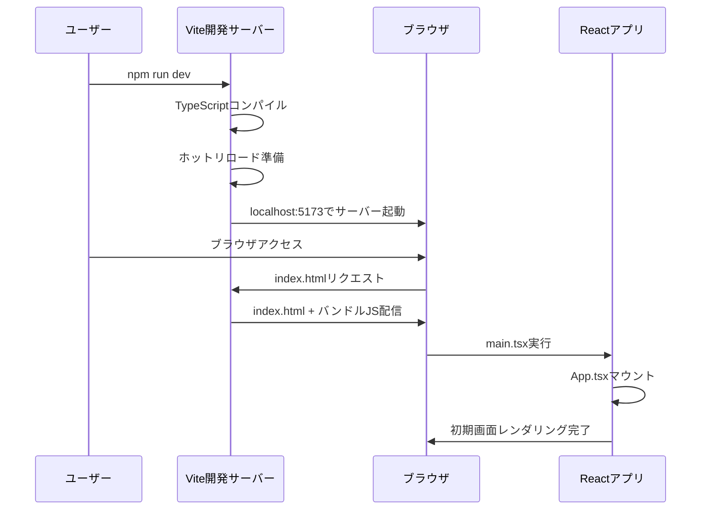
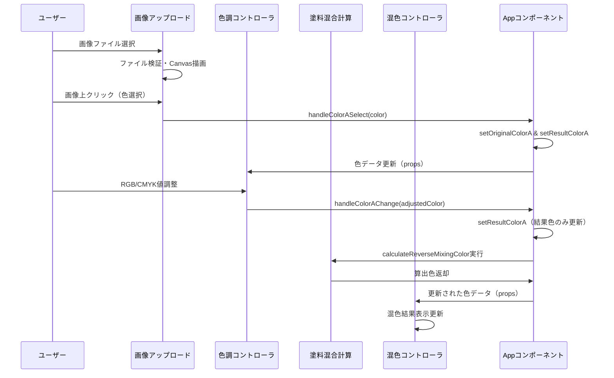

# paint-color-assistant2 技術解説文書

## 概要

paint-color-assistant2は、塗装色混合アシスタントのフロントエンド専用システムです。Reactで構築されており、画像から色を抽出し、色調整を行い、必要な塗料調整を計算する機能を提供します。

## システム構成

### 技術スタック
- **フロントエンド**: React 18 + TypeScript
- **ビルドツール**: Vite
- **スタイリング**: CSS + Tailwind CSS
- **テスト**: Vitest + Puppeteer
- **開発環境**: Node.js

### プロジェクト構造
```
frontend/
├── src/
│   ├── components/          # Reactコンポーネント
│   ├── hooks/              # カスタムフック
│   ├── utils/              # ユーティリティ関数
│   ├── types/              # TypeScript型定義
│   ├── styles/             # スタイル関連
│   └── test/               # テストファイル
├── public/                 # 静的ファイル
└── dist/                   # ビルド出力
```

## 処理シーケンス解説

### 1. サーバー起動からブラウザ表示まで



#### 詳細処理フロー

1. **Vite起動処理**
   - `package.json`の`dev`スクリプト実行
   - TypeScriptファイルのコンパイル
   - ホットリロード機能の有効化

2. **React初期化**
   ```typescript
   // main.tsx
   createRoot(document.getElementById('root')!).render(
     <StrictMode>
       <App />
     </StrictMode>
   )
   ```

3. **App.tsx初期化**
   - レスポンシブレイアウトフックの初期化
   - 状態管理の初期化（色、画像データ）
   - デバッグモード判定

### 2. 画像A選択→色調整→塗料調整→混色コントローラへのイベント伝播



#### イベント伝播の仕組み

1. **画像選択時のイベント**
   ```typescript
   const handleImageASelect = useCallback((image: AppImageData) => {
     setImageDataA(image);
     setImagePathA(image.file.name);
   }, []);
   ```

2. **色選択時のイベント（プレビュークリック）**
   ```typescript
   const handleColorASelect = useCallback((color: ColorModel) => {
     // 出発色と結果色の両方を同じ色に設定
     setOriginalColorA(color);
     setResultColorA(color);
   }, []);
   ```

3. **色調整時のイベント（RGB/CMYK変更）**
   ```typescript
   const handleColorAChange = useCallback((color: ColorModel) => {
     // 結果色のみ更新（出発色は保持）
     setResultColorA(color);
   }, []);
   ```

### 3. Reactにおける重要なイベント伝播の仕組み

#### Props Down, Events Up パターン

```typescript
// 親コンポーネント（App.tsx）
<ColorController
  originalColor={originalColorA}      // Props Down
  resultColor={resultColorA}          // Props Down
  onChange={handleColorAChange}       // Events Up
  label="色調コントローラA"
/>
```

#### useCallback による最適化

```typescript
// メモ化されたコールバック関数
const handleColorAChange = useCallback((color: ColorModel) => {
  setResultColorA(color);
}, []); // 依存配列が空なので、関数は一度だけ作成される
```

#### useMemo による算出色の最適化

```typescript
// 依存する値が変更された時のみ再計算
const calculatedColor = useMemo(() => {
  return PaintMixingCalculator.calculateReverseMixingColor(resultColorA, resultColorB);
}, [resultColorA, resultColorB]);
```

## 色変換処理解説

### RGB→CMYK変換処理

#### 変換アルゴリズム

```typescript
static rgbToCmyk(r: number, g: number, b: number): CmykColor {
  // 1. RGB値を0-1の範囲に正規化
  const rNorm = Math.max(0, Math.min(255, Math.round(r))) / 255;
  const gNorm = Math.max(0, Math.min(255, Math.round(g))) / 255;
  const bNorm = Math.max(0, Math.min(255, Math.round(b))) / 255;

  // 2. 初期CMY値を計算（補色関係）
  let c = 1 - rNorm;  // シアン = 1 - 赤
  let m = 1 - gNorm;  // マゼンタ = 1 - 緑
  let y = 1 - bNorm;  // イエロー = 1 - 青

  // 3. K（黒）成分を計算（CMYの最小値）
  const k = Math.min(c, Math.min(m, y));
  
  // 4. 完全な黒の特殊処理
  if (k >= 0.9999) {
    return { c: 0, m: 0, y: 0, k: 100 };
  }

  // 5. CMY成分を正規化（黒成分を除去）
  const denominator = 1 - k;
  if (denominator > 0.0001) {
    c = (c - k) / denominator;
    m = (m - k) / denominator;
    y = (y - k) / denominator;
  }

  // 6. 0.1%精度で丸めて返却
  return {
    c: Math.round(c * 1000) / 10,
    m: Math.round(m * 1000) / 10,
    y: Math.round(y * 1000) / 10,
    k: Math.round(k * 1000) / 10
  };
}
```

#### 変換の数学的背景

1. **補色関係**: RGB色空間とCMY色空間は補色関係にある
   - C = 1 - R, M = 1 - G, Y = 1 - B

2. **黒成分の分離**: 印刷業界では黒インクを別途使用するため、CMYから黒成分を分離
   - K = min(C, M, Y)

3. **正規化**: 黒成分を除去した後、残りのCMY成分を正規化
   - C' = (C - K) / (1 - K)

### CMYK→RGB変換処理

#### 変換アルゴリズム

```typescript
static cmykToRgb(c: number, m: number, y: number, k: number): RgbColor {
  // 1. CMYK値を0-1の範囲に正規化
  const cNorm = Math.max(0, Math.min(100, c)) / 100;
  const mNorm = Math.max(0, Math.min(100, m)) / 100;
  const yNorm = Math.max(0, Math.min(100, y)) / 100;
  const kNorm = Math.max(0, Math.min(100, k)) / 100;

  // 2. 標準的なCMYK→RGB変換式
  const r = 255 * (1 - cNorm) * (1 - kNorm);
  const g = 255 * (1 - mNorm) * (1 - kNorm);
  const b = 255 * (1 - yNorm) * (1 - kNorm);

  // 3. 整数に丸めて返却
  return {
    r: Math.round(Math.max(0, Math.min(255, r))),
    g: Math.round(Math.max(0, Math.min(255, g))),
    b: Math.round(Math.max(0, Math.min(255, b)))
  };
}
```

#### 変換の数学的背景

1. **逆変換**: RGB→CMYKの逆演算
   - R = (1 - C) × (1 - K)
   - G = (1 - M) × (1 - K)  
   - B = (1 - Y) × (1 - K)

2. **黒成分の影響**: K値が大きいほど全体的に暗くなる

### 変換ループ防止機能

```typescript
static safeColorUpdate(source: ColorUpdateSource, updateFn: () => void): void {
  if (this.updateInProgress) {
    return; // ループ防止
  }

  this.updateInProgress = true;
  this.lastUpdateSource = source;

  try {
    updateFn();
  } finally {
    this.updateInProgress = false;
    setTimeout(() => {
      this.lastUpdateSource = null;
    }, 50);
  }
}
```

## 補色を加味した塗料調整CMYKW算出

### 補色理論に基づく塗料調整

#### 基本原理

1. **補色関係**: 色相環で正反対に位置する色同士
   - シアン ↔ 赤（マゼンタ + イエロー）
   - マゼンタ ↔ 緑（シアン + イエロー）
   - イエロー ↔ 青（シアン + マゼンタ）

2. **中和効果**: 補色を混合すると彩度が下がり、グレーに近づく

#### 塗料調整アルゴリズム

```typescript
static calculateMixingRatio(colorA: ColorModel, colorB: ColorModel): MixingResult {
  const instructions: MixingInstruction[] = [];
  
  // CMYK差分計算
  const cyanDelta = Math.round(colorB.c) - Math.round(colorA.c);
  const magentaDelta = Math.round(colorB.m) - Math.round(colorA.m);
  const yellowDelta = Math.round(colorB.y) - Math.round(colorA.y);
  const blackDelta = Math.round(colorB.k) - Math.round(colorA.k);
  
  // シアン処理例
  if (cyanDelta > 0) {
    // シアンを追加
    instructions.push({
      pigmentName: 'シアン',
      amount: cyanDelta,
      displayColor: '#00FFFF',
      description: 'シアンを追加'
    });
  } else if (cyanDelta < 0) {
    // シアンを減らす = 補色（マゼンタ+イエロー）を追加
    const neutralizeAmount = Math.abs(cyanDelta);
    instructions.push({
      pigmentName: 'マゼンタ',
      amount: neutralizeAmount,
      displayColor: '#FF00FF',
      description: 'シアンを中和するためマゼンタを追加'
    });
    instructions.push({
      pigmentName: 'イエロー',
      amount: neutralizeAmount,
      displayColor: '#FFFF00',
      description: 'シアンを中和するためイエローを追加'
    });
  }
  
  // マゼンタ、イエローも同様の処理...
}
```

#### CMYKW（白含む）の相互作用

```typescript
// 白と黒の相互作用計算
const whiteAmount = adjustments.white;
const blackAmount = adjustments.black;
const grayEffect = Math.min(whiteAmount, blackAmount);
const netWhite = whiteAmount - grayEffect;
const netBlack = blackAmount - grayEffect;

// 白の効果（K値を減少させる）
if (netWhite > 0) {
  adjustedCmyk.k = Math.max(0, adjustedCmyk.k - netWhite);
}

// グレー効果による彩度低下（CMY値を減少）
if (grayEffect > 0) {
  const saturationReduction = grayEffect * 0.3; // 30%の彩度低下
  adjustedCmyk.c = Math.max(0, adjustedCmyk.c - saturationReduction);
  adjustedCmyk.m = Math.max(0, adjustedCmyk.m - saturationReduction);
  adjustedCmyk.y = Math.max(0, adjustedCmyk.y - saturationReduction);
}
```

## RGB+CMYKWによる結果色算出

### 統合色計算アルゴリズム

```typescript
static calculateReverseMixingColor(baseColor: ColorModel, targetColor: ColorModel): ColorModel {
  // 1. 必要な塗料調整を取得
  const mixingResult = this.calculateMixingRatio(baseColor, targetColor);
  
  // 2. 調整値を適用
  let adjustedCmyk = {
    c: Math.max(0, Math.min(100, Math.round(baseColor.c) + adjustments.cyan)),
    m: Math.max(0, Math.min(100, Math.round(baseColor.m) + adjustments.magenta)),
    y: Math.max(0, Math.min(100, Math.round(baseColor.y) + adjustments.yellow)),
    k: Math.max(0, Math.min(100, Math.round(baseColor.k) + netBlack))
  };
  
  // 3. CMYK→RGB変換
  const k = adjustedCmyk.k / 100;
  const c = adjustedCmyk.c / 100 * (1 - k);
  const m = adjustedCmyk.m / 100 * (1 - k);
  const y = adjustedCmyk.y / 100 * (1 - k);
  
  const r = Math.round(255 * (1 - c) * (1 - k));
  const g = Math.round(255 * (1 - m) * (1 - k));
  const b = Math.round(255 * (1 - y) * (1 - k));
  
  return {
    r: Math.max(0, Math.min(255, r)),
    g: Math.max(0, Math.min(255, g)),
    b: Math.max(0, Math.min(255, b)),
    ...adjustedCmyk
  };
}
```

### 計算の流れ

1. **ベース色の取得**: 出発色（画像Aの調整後色）
2. **目標色との差分計算**: CMYK各成分の差分
3. **補色理論の適用**: 減色時は補色を追加
4. **白黒相互作用の計算**: グレー効果の考慮
5. **最終色の算出**: 調整後CMYK→RGB変換

## utilsの再利用可能性と関数一覧

### colorUtils.ts

#### 再利用可能性
- **高い再利用性**: 色変換は汎用的な処理
- **独立性**: 他のモジュールに依存しない
- **拡張性**: 新しい色空間への対応が容易

#### 主要関数一覧

| 関数名 | 概要 | 入力 | 出力 |
|--------|------|------|------|
| `ColorSpaceConverter.rgbToCmyk` | RGB→CMYK高精度変換 | RGB値(0-255) | CMYK値(0-100%) |
| `ColorSpaceConverter.cmykToRgb` | CMYK→RGB高精度変換 | CMYK値(0-100%) | RGB値(0-255) |
| `ColorSpaceConverter.safeColorUpdate` | 変換ループ防止機能 | 更新ソース、更新関数 | void |
| `createColorModel` | ColorModel作成ヘルパー | RGB値、CMYK値(省略可) | ColorModel |
| `clampRgbValue` | RGB値範囲制限 | 数値 | 0-255の範囲内数値 |
| `clampCmykValue` | CMYK値範囲制限 | 数値 | 0-100の範囲内数値 |
| `colorToCss` | CSS色文字列生成 | ColorModel | CSS rgb()文字列 |
| `createSingleColorSample` | RGB単色見本生成 | 色成分、値 | CSS色文字列 |
| `createCmykSingleColorSample` | CMYK単色見本生成 | CMYK成分、値 | CSS色文字列 |

### imageUtils.ts

#### 再利用可能性
- **中程度の再利用性**: 画像処理は汎用的だが、Canvas依存
- **ブラウザ依存**: Canvas APIを使用
- **拡張性**: 新しい画像フォーマットへの対応が可能

#### 主要関数一覧

| 関数名 | 概要 | 入力 | 出力 |
|--------|------|------|------|
| `ImageProcessor.createImageData` | ファイルから画像データ作成 | File | Promise<ImageData> |
| `ImageProcessor.extractColorFromCanvas` | Canvas座標から色抽出 | Canvas、座標 | ColorModel |
| `ImageProcessor.drawImageToCanvas` | 画像をCanvasに描画 | Canvas、画像データ | void |
| `ImageProcessor.calculateDisplaySize` | 表示サイズ計算 | 元サイズ、最大サイズ | 計算サイズ |
| `ImageProcessor.isSupportedImageFormat` | 対応フォーマット判定 | File | boolean |
| `ImageProcessor.isValidFileSize` | ファイルサイズ検証 | File、最大サイズ | boolean |
| `ImageProcessor.validateImageFile` | 画像ファイル検証 | File | 検証結果 |
| `ImageProcessor.cleanupImageUrl` | 画像URL クリーンアップ | ImageData | void |

### paintMixing.ts

#### 再利用可能性
- **高い再利用性**: 塗料混合計算は印刷・塗装業界で汎用的
- **独立性**: 色変換以外の依存なし
- **専門性**: 印刷・塗装業界の知識が必要

#### 主要関数一覧

| 関数名 | 概要 | 入力 | 出力 |
|--------|------|------|------|
| `PaintMixingCalculator.calculateMixingRatio` | 混合比率計算 | 出発色、目標色 | MixingResult |
| `PaintMixingCalculator.calculateReverseMixingColor` | 逆算結果色計算 | 出発色、目標色 | ColorModel |
| `PaintMixingCalculator.consolidateInstructions` | 塗料指示統合 | 指示配列 | 統合指示配列 |
| `PaintMixingCalculator.formatMixingText` | 表示文字列生成 | 指示配列 | 表示文字列 |

### logger.ts

#### 再利用可能性
- **非常に高い再利用性**: ログ機能は全プロジェクトで使用可能
- **設定可能**: 環境変数による動作制御
- **拡張性**: 新しいログレベルや出力先の追加が容易

#### 主要関数一覧

| 関数名 | 概要 | 入力 | 出力 |
|--------|------|------|------|
| `logger.debug` | デバッグログ出力 | メッセージ、引数 | void |
| `logger.info` | 情報ログ出力 | メッセージ、引数 | void |
| `logger.warn` | 警告ログ出力 | メッセージ、引数 | void |
| `logger.error` | エラーログ出力 | メッセージ、引数 | void |
| `debugLog` | デバッグログ便利関数 | メッセージ、引数 | void |

### mobileUtils.ts

#### 再利用可能性
- **高い再利用性**: モバイル対応は多くのWebアプリで必要
- **プラットフォーム依存**: ブラウザ・デバイス依存
- **拡張性**: 新しいモバイル機能への対応が可能

#### 主要関数一覧

| 関数名 | 概要 | 入力 | 出力 |
|--------|------|------|------|
| `isMobileEnvironment` | モバイル環境判定 | なし | boolean |
| `isIOSEnvironment` | iOS環境判定 | なし | boolean |
| `checkCameraAccess` | カメラアクセス可能性チェック | なし | Promise<boolean> |
| `createMobileFileInput` | モバイル最適化ファイル入力作成 | オプション | HTMLInputElement |
| `convertHEICToJPEG` | HEIC→JPEG変換 | File | Promise<File> |
| `resizeImageForMobile` | モバイル用画像リサイズ | File、サイズ、品質 | Promise<File> |

### pathUtils.ts

#### 再利用可能性
- **高い再利用性**: ファイルパス処理は汎用的
- **OS依存**: Windows/Unix パス形式に対応
- **拡張性**: 新しいパス形式への対応が容易

#### 主要関数一覧

| 関数名 | 概要 | 入力 | 出力 |
|--------|------|------|------|
| `cleanFilePath` | ファイルパスクリーニング | 生パス文字列 | クリーン済みパス |
| `validateFilePath` | ファイルパス検証 | ファイルパス | 検証結果 |
| `getFileExtension` | ファイル拡張子取得 | ファイルパス | 拡張子 |
| `isSupportedImageExtension` | 対応画像拡張子判定 | ファイルパス | boolean |

## 再利用可能なコンポーネント

### ImageUpload コンポーネント

#### 再利用可能性
- **高い再利用性**: 画像アップロード機能は多くのアプリで必要
- **カスタマイズ性**: props による動作制御
- **レスポンシブ対応**: デバイスタイプに応じた最適化

#### 主要機能
- ドラッグ&ドロップ対応
- ファイル形式検証
- 画像プレビュー表示
- 色抽出機能
- モバイル最適化

### ColorController コンポーネント

#### 再利用可能性
- **中程度の再利用性**: 色調整機能は特定用途向け
- **専門性**: RGB/CMYK変換知識が必要
- **拡張性**: 新しい色空間への対応が可能

#### 主要機能
- RGB/CMYK双方向変換
- リアルタイム色プレビュー
- 数値入力とスライダー対応
- 変換ループ防止

### PaintMixingController コンポーネント

#### 再利用可能性
- **低い再利用性**: 塗料混合は特殊用途
- **専門性**: 印刷・塗装業界の知識が必要
- **独立性**: 他システムへの移植は困難

#### 主要機能
- 塗料調整計算
- 混色結果表示
- 補色理論適用
- CMYKW相互作用計算

### ImageSwapButton コンポーネント

#### 再利用可能性
- **高い再利用性**: 交換機能は汎用的
- **シンプル性**: 単純な機能で移植が容易
- **カスタマイズ性**: スタイルの変更が容易

#### 主要機能
- 画像・色データの交換
- アニメーション効果
- アクセシビリティ対応

## カスタムフック

### useResponsiveLayout

#### 再利用可能性
- **非常に高い再利用性**: レスポンシブ対応は全Webアプリで必要
- **汎用性**: デバイス判定とレイアウト制御
- **拡張性**: 新しいブレークポイントの追加が容易

#### 主要機能
- デバイスタイプ判定（mobile/tablet/desktop）
- 画面サイズ監視
- レスポンシブ設定計算
- UI レイアウトモデル提供

### useColorConversion

#### 再利用可能性
- **中程度の再利用性**: 色変換機能は特定用途向け
- **専門性**: 色理論の知識が必要
- **独立性**: 色変換ロジックのカプセル化

### useImageProcessing

#### 再利用可能性
- **高い再利用性**: 画像処理は多くのアプリで必要
- **ブラウザ依存**: Canvas API使用
- **拡張性**: 新しい画像処理機能の追加が容易

### useLongPress

#### 再利用可能性
- **非常に高い再利用性**: 長押し機能は汎用的
- **モバイル対応**: タッチデバイス最適化
- **カスタマイズ性**: 長押し時間の調整可能

## まとめ

paint-color-assistant2は、色変換・画像処理・塗料混合計算を中心とした専門的なWebアプリケーションです。utilsモジュールの多くは高い再利用可能性を持ち、特に色変換（colorUtils）、ログ機能（logger）、モバイル対応（mobileUtils）は他のプロジェクトでも活用できます。

コンポーネントについては、ImageUploadやレスポンシブ対応フックは汎用性が高く、PaintMixingControllerは専門性が高いという特徴があります。全体的に、モジュール化とTypeScriptによる型安全性により、保守性と拡張性を両立した設計となっています。